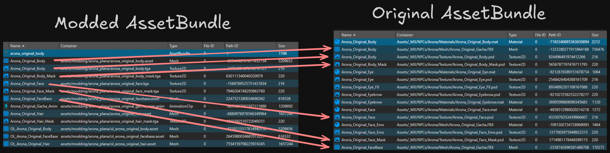

# Blue Archive - Mod Updater

A tool that re-dump AssetBundle for Blue Archive.

> [!IMPORTANT]
> **BA-MU** is not a model loader
> 

## Install

### Requirements
- [.NET Runtime 9.0](https://dotnet.microsoft.com/download/dotnet/9.0) or higher

### Release
You can download the latest [releases](https://github.com/Deathemonic/BA-MU/releases)

[Windows](https://github.com/Deathemonic/BA-MU/releases/latest/download/BA-MU-win-x64.zip) | [Linux](https://github.com/Deathemonic/BA-MU/releases/latest/download/BA-MU-linux-x64.zip) | [MacOS](https://github.com/Deathemonic/BA-MU/releases/latest/download/BA-MU-osx-arm64.zip)

## Usage

BA-MU automates the process of transferring modifications from a modded AssetBundle to an original (or "patch") AssetBundle. This is useful for updating mods when a game receives a new patch.

The process works as follows:
1.  **Compare:** The tool identifies assets that exist in both the `--modded` and `--patch` bundles by matching their names and types.
2.  **Export:** Matched assets from the `--modded` bundle are exported to a `Dumps` folder.
    -   `Texture2D` assets are saved as images (`.tga` or `.png`).
    -   `TextAsset` assets are saved as data files (`.txt` or `.bytes`).
    -   All other asset types are saved as structured `.json` files.
3.  **Import:** The exported files are then read, and their data is used to overwrite the corresponding assets in the `--patch` bundle.
4.  **Save:** A new, modified AssetBundle is saved in the `Modded` folder, containing the original patch content updated with your mods.



### Basic Example

```shell
bamu --modded your_modded.bundle --patch game_asset.bundle
```

This command will find matching assets, export the modified ones from `your_modded.bundle`, and import them into `game_asset.bundle`, saving the result in a new bundle inside the `Modded` directory.

<details>
<summary>Command Line</summary>

### `bamu --help`

| Argument                 | Alias       | Description                                                                   | Default |
|--------------------------|-------------|-------------------------------------------------------------------------------|---------|
| `--modded <path>`        | `-m`        | **(Required)** Path to the modded asset bundle.                               |         |
| `--patch <path>`         | `-p`        | **(Required)** Path to the original/patch asset bundle.                       |         |
| `--imageFormat <format>` | `--image`   | Sets the export format for textures.                                          | `tga`   |
| `--textFormat <format>`  | `--text`    | Sets the export format for text assets.                                       | `txt`   |
| `--includeTypes <types>` | `--include` | Comma-separated list of asset types to include (e.g., "texture2d,textasset"). |         |
| `--excludeTypes <types>` | `--exclude` | Comma-separated list of asset types to exclude.                               |         |
| `--onlyTypes <types>`    | `--only`    | Only process assets of these specific types.                                  |         |
| `--verbose`              | `-v`        | Enables detailed debug logging.                                               | `false` |
| `--types`                | `-t`        | Lists all available asset types and exits.                                    | `false` |


</details>

## Building

1. Install [.NET SDK 9.0](https://dotnet.microsoft.com/en-us/download/dotnet/9.0)
2. Clone this repository
```sh
git clone https://github.com/Deathemonic/BA-MU
cd BA-MU
```
3. Build using `dotnet`
```sh
dotnet build
```

### Other Projects

- [BA-AD](https://github.com/Deathemonic/BA-AD): A tool and library that downloads the latest **Blue Archive** assets.
- [BA-AX](https://github.com/Deathemonic/BA-AX): A tool and library that extracts **Blue Archive** assets.
- [BA-FB](https://github.com/Deathemonic/BA-FB): A tool for dumping and generating **Blue Archive** flatbuffers.
- [BA-CY](https://github.com/Deathemonic/BA-CY): Library for handling **Blue Archive** catalogs, tables, serialization/deserialization, encryption, and hashing.


### Contributing
Don't like my [shitty code](https://www.reddit.com/r/programminghorror) and what to change it? Feel free to contribute by submitting a pull request or issue. Always appreciate the help.


### Acknowledgement
- [nesrak1/UABEA](https://github.com/nesrak1/UABEA)
- [nesrak1/AssetsTools.NET](https://github.com/nesrak1/AssetsTools.NET)

### Copyright
Blue Archive is a registered trademark of NAT GAMES Co., Ltd., NEXON Korea Corp., and Yostar, Inc.
This project is not affiliated with, endorsed by, or connected to NAT GAMES Co., Ltd., NEXON Korea Corp., NEXON GAMES Co., Ltd., IODivision, Yostar, Inc., or any of their subsidiaries or affiliates.
All game assets, content, and materials are copyrighted by their respective owners and are used for informational and educational purposes only.