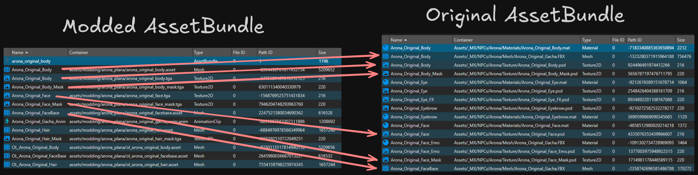

# Blue Archive - Mod Updater

A tool that re-dump AssetBundle for Blue Archive.

> [!WARNING]
> This is a `Work in Progress/Proof of Concept` Project


## How this works?
This will export the dumps from your modded AssetBundle then import it to the original AssetBundle

*Technically this should work on some Unity Games, but it's not tested. The only game I tested is MiSide*


```shell
>> bamu --modded your_modded.bundle --patch game_asset.bundle --only "mesh"
```

This will load `your_modded.bundle` and `game_asset.bundle` then it will do a match if the modded asset `m_Name` and `PathID` matches
with the patch asset then it will export it as a `.json` using that JSON it will import it back to patch AssetBundle then save it on another folder.

To make it work, your modded AssetBundle should have the same name asset as the patch AssetBundle.



## TODO

- [/] Handle Texture2D
- [ ] Handle Text Asset / Spine2D


## Install

### Requirements
- [.NET 9.0 Runtime](https://dotnet.microsoft.com/download/dotnet/9.0) or higher

### Release
You can download the latest [nightly releases](https://nightly.link/Deathemonic/BA-MU/workflows/build/main)

[Windows (Nightly)](https://nightly.link/Deathemonic/BA-MU/workflows/build/main/BA-MU-win-x64.zip) | [Linux (Nightly)](https://nightly.link/Deathemonic/BA-MU/workflows/build/main/BA-MU-linux-x64.zip) | [MacOS (Nightly)](https://nightly.link/Deathemonic/BA-MU/workflows/build/main/BA-MU-osx-arm64.zip)

## Building

1. Install [.Net 9.0 SDK](https://dotnet.microsoft.com/en-us/download/dotnet/9.0)
2. Clone this repository
```sh
git clone https://github.com/Deathemonic/BA-MU
cd BA-MU
```
3. Build using `dotnet`
```sh
dotnet build
```

### Other Projects

- [BA-AD](https://github.com/Deathemonic/BA-AD): A tool and library that downloads the latest **Blue Archive** assets.
- [BA-AX](https://github.com/Deathemonic/BA-AX): A tool and library that extracts **Blue Archive** assets.
- [BA-FB](https://github.com/Deathemonic/BA-FB): A tool for dumping and generating **Blue Archive** flatbuffers.
- [BA-CY](https://github.com/Deathemonic/BA-CY): Library for handling **Blue Archive** catalogs, tables, serialization/deserialization, encryption, and hashing.


### Contributing
Don't like my [shitty code](https://www.reddit.com/r/programminghorror) and what to change it? Feel free to contribute by submitting a pull request or issue. Always appreciate the help.


### Acknowledgement
- [nesrak1/UABEA](https://github.com/nesrak1/UABEA)
- [nesrak1/AssetsTools.NET](https://github.com/nesrak1/AssetsTools.NET)

### Copyright
Blue Archive is a registered trademark of NAT GAMES Co., Ltd., NEXON Korea Corp., and Yostar, Inc.
This project is not affiliated with, endorsed by, or connected to NAT GAMES Co., Ltd., NEXON Korea Corp., NEXON GAMES Co., Ltd., IODivision, Yostar, Inc., or any of their subsidiaries or affiliates.
All game assets, content, and materials are copyrighted by their respective owners and are used for informational and educational purposes only.